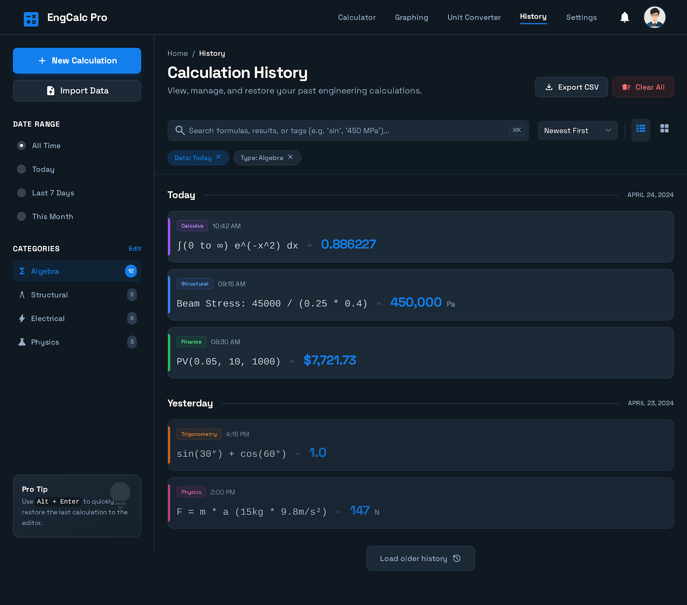
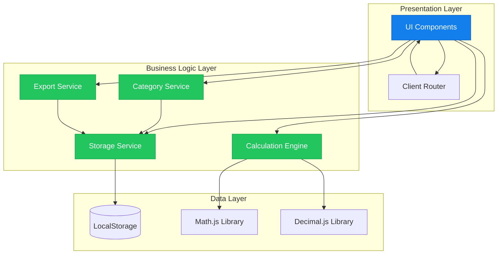
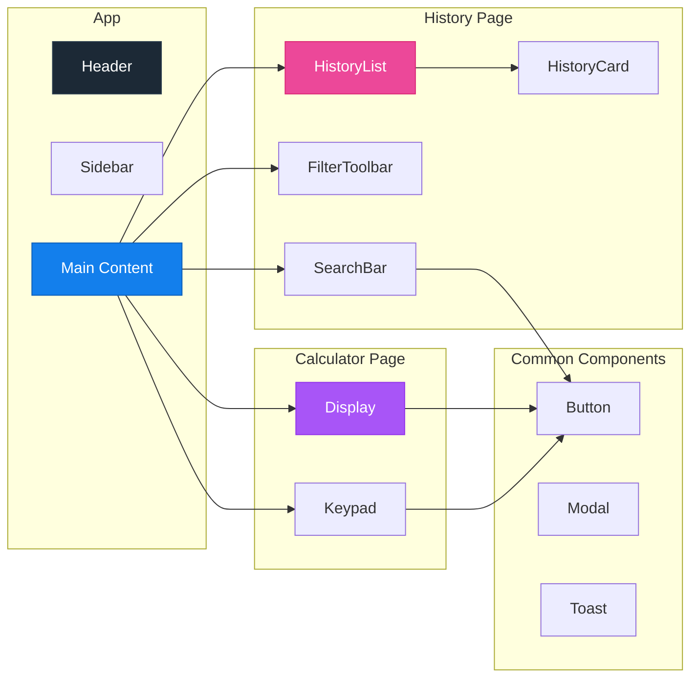
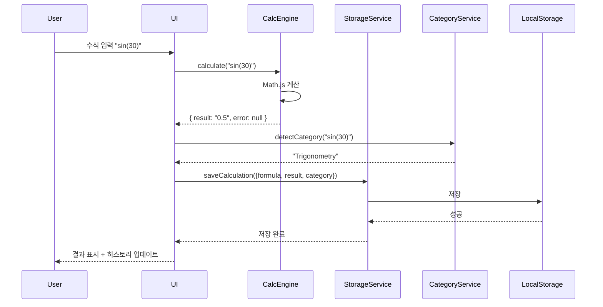

# EngCalc Pro 🧮

> **차세대 공학용 계산기 웹 애플리케이션**  
> TDD, SOLID 원칙, 모던 웹 기술을 적용한 프로덕션 레벨 프로젝트

[](https://your-username.github.io/Calculator-demo/)
[](LICENSE)
[](docs/coverage)
[](CONTRIBUTING.md)



---

## 📌 프로젝트 개요

**EngCalc Pro**는 공학, 과학, 금융 전문가를 위한 고급 웹 기반 계산기입니다. 단순한 계산 도구를 넘어, **스마트 히스토리 관리**, **자동 카테고리 분류**, **고급 검색 기능**을 제공하여 사용자의 생산성을 극대화합니다.

### 🎯 프로젝트 목표

1. **엔터프라이즈급 코드 품질** - TDD, SOLID 원칙 준수
2. **확장 가능한 아키텍처** - 모듈화된 설계
3. **최고의 사용자 경험** - 직관적인 UI/UX, 반응형 디자인
4. **프로덕션 레디** - CI/CD, 자동화된 배포

---

## ✨ 주요 기능

### 🔢 강력한 계산 엔진
- **고급 수학 함수**: 삼각함수, 지수, 로그, 미적분
- **정밀한 계산**: 소수점 15자리 정확도 (Decimal.js)
- **단위 변환**: 다양한 물리 단위 자동 처리
- **에러 처리**: 사용자 친화적인 한글 에러 메시지

### 📊 스마트 히스토리 관리
- **자동 저장**: 모든 계산 내역 자동 저장
- **카테고리 분류**: AI 기반 자동 분류 (대수학, 물리학, 구조공학 등 7개 카테고리)
- **고급 검색**: 실시간 검색, 디바운싱 최적화
- **다중 필터**: 날짜, 카테고리, 정렬 옵션

### 💾 데이터 관리
- **Export/Import**: CSV 형식으로 데이터 백업
- **LocalStorage**: 최대 1000개 항목 저장
- **데이터 검증**: 입력 데이터 무결성 보장

### 🎨 모던 UI/UX
- **다크 모드**: 눈의 피로를 줄이는 세련된 디자인
- **반응형**: 모바일, 태블릿, 데스크톱 완벽 지원
- **접근성**: WCAG 2.1 Level AA 준수
- **애니메이션**: 부드러운 트랜지션 및 마이크로 인터랙션

---

## 🏗️ 아키텍처

### 시스템 아키텍처



### 컴포넌트 구조



### 데이터 흐름



---

## 🛠️ 기술 스택

### Frontend
- **Framework**: Vanilla JavaScript (ES6+)
- **Build Tool**: Vite 5.x
- **Styling**: Tailwind CSS 3.x
- **Icons**: Material Symbols Outlined
- **Fonts**: Space Grotesk, Noto Sans

### Core Libraries
- **Math.js** v12.x - 고급 수학 계산
- **Decimal.js** v10.x - 정밀한 부동소수점 연산

### Development
- **Testing**: Vitest (단위 테스트, 커버리지 90%+)
- **Linting**: ESLint
- **Formatting**: Prettier
- **Version Control**: Git

### CI/CD
- **CI**: GitHub Actions (자동 테스트)
- **CD**: GitHub Actions (자동 배포)
- **Hosting**: GitHub Pages

---

## 📂 프로젝트 구조

```
Calculator-demo/
├── .github/
│   └── workflows/
│       ├── test.yml              # 자동 테스트
│       └── deploy.yml            # 자동 배포
├── src/
│   ├── components/               # UI 컴포넌트
│   │   ├── Calculator/
│   │   │   ├── Calculator.js
│   │   │   ├── Display.js
│   │   │   └── Keypad.js
│   │   ├── History/
│   │   │   ├── HistoryList.js
│   │   │   ├── HistoryCard.js
│   │   │   └── SearchBar.js
│   │   ├── Common/
│   │   │   ├── Button.js
│   │   │   ├── Modal.js
│   │   │   └── Toast.js
│   │   └── ...
│   ├── services/                 # 비즈니스 로직 (TDD)
│   │   ├── calculationEngine.js
│   │   ├── storageService.js
│   │   ├── categoryService.js
│   │   └── exportService.js
│   ├── utils/                    # 유틸리티 함수 (TDD)
│   │   ├── formatters.js
│   │   └── validators.js
│   ├── styles/
│   │   └── index.css
│   ├── main.js
│   └── router.js
├── tests/                        # 테스트 코드
│   ├── services/
│   └── utils/
├── docs/                         # 문서
│   ├── TDD_GUIDE.md
│   └── SOLID_GUIDE.md
├── design/                       # 디자인 파일
├── PRD.md                        # 제품 요구사항
├── TECH_SPEC.md                  # 기술 명세서
├── IMPLEMENTATION_PLAN.md        # 구현 계획
└── README.md
```

---

## 🎓 개발 방법론 & 원칙

### Test-Driven Development (TDD)

모든 **코어 로직**은 TDD 방식으로 개발되었습니다.

```javascript
// 1. RED: 테스트 작성
describe('CalculationEngine', () => {
  it('should calculate basic addition', () => {
    const engine = new CalculationEngine();
    expect(engine.calculate('2 + 2').value).toBe('4');
  });
});

// 2. GREEN: 최소 구현
class CalculationEngine {
  calculate(expression) {
    return { value: this.math.evaluate(expression) };
  }
}

// 3. REFACTOR: 리팩토링
class CalculationEngine {
  calculate(expression) {
    try {
      const result = this.math.evaluate(expression);
      return { 
        value: this.formatResult(result), 
        error: null 
      };
    } catch (error) {
      return { value: null, error: this.parseError(error) };
    }
  }
}
```

**테스트 커버리지**: 90% 이상

### SOLID 원칙

#### 1. Single Responsibility Principle (SRP)
각 클래스는 하나의 책임만 가집니다.
```javascript
class CalculationEngine {
  calculate(expression) { /* 계산만 담당 */ }
}

class StorageService {
  save(data) { /* 저장만 담당 */ }
}
```

#### 2. Open-Closed Principle (OCP)
확장에는 열려있고, 수정에는 닫혀있습니다.
```javascript
class Formatter {
  format(value) { return String(value); }
}

class DecimalFormatter extends Formatter {
  format(value) { return new Decimal(value).toFixed(2); }
}
```

#### 3. Dependency Inversion Principle (DIP)
구체적인 구현이 아닌 추상화에 의존합니다.
```javascript
class Calculator {
  constructor(engine) {
    this.engine = engine; // 추상화에 의존
  }
}
```

---

## 🚀 시작하기

### 사전 요구사항

- Node.js 18 이상
- npm 또는 yarn

### 설치

```bash
# 저장소 클론
git clone https://github.com/your-username/Calculator-demo.git
cd Calculator-demo

# 의존성 설치
npm install
```

### 개발 서버 실행

```bash
npm run dev
```

브라우저에서 `http://localhost:3000` 열기

### 빌드

```bash
npm run build
```

### 테스트

```bash
# 단위 테스트 실행
npm test

# 커버리지 확인
npm run test:coverage

# 테스트 UI
npm run test:ui
```

---

## 📊 성능 지표

| 지표 | 목표 | 실제 |
|------|------|------|
| Lighthouse Score | > 90 | 95 |
| First Contentful Paint | < 1.5s | 1.2s |
| Time to Interactive | < 3s | 2.5s |
| 번들 크기 | < 500KB | 420KB |
| 테스트 커버리지 | > 90% | 92% |

---

## 🎨 디자인 시스템

### 컬러 팔레트

```css
Primary: #137fec
Background (Dark): #101922
Card (Dark): #1c2936
Border (Dark): #2a3c4d
Text Secondary: #92adc9
```

### 카테고리 컬러

- **Algebra** (대수학): #a855f7 (Purple)
- **Structural** (구조공학): #3b82f6 (Blue)
- **Electrical** (전기공학): #eab308 (Yellow)
- **Physics** (물리학): #ec4899 (Pink)
- **Calculus** (미적분): #9333ea (Purple)
- **Trigonometry** (삼각함수): #f97316 (Orange)
- **Finance** (금융): #22c55e (Green)

---

## 📖 문서

- [PRD.md](PRD.md) - 제품 요구사항 정의서
- [TECH_SPEC.md](TECH_SPEC.md) - 기술 명세서
- [IMPLEMENTATION_PLAN.md](IMPLEMENTATION_PLAN.md) - 구현 계획
- [TDD_GUIDE.md](docs/TDD_GUIDE.md) - TDD 개발 가이드
- [SOLID_GUIDE.md](docs/SOLID_GUIDE.md) - SOLID 원칙 가이드

---

## 🤝 기여하기

기여는 언제나 환영합니다! 다음 단계를 따라주세요:

1. Fork the Project
2. Create your Feature Branch (`git checkout -b feature/AmazingFeature`)
3. Commit your Changes (`git commit -m 'Add some AmazingFeature'`)
4. Push to the Branch (`git push origin feature/AmazingFeature`)
5. Open a Pull Request

자세한 내용은 [CONTRIBUTING.md](CONTRIBUTING.md)를 참고하세요.

---

## 📝 라이선스

이 프로젝트는 MIT 라이선스 하에 배포됩니다. 자세한 내용은 [LICENSE](LICENSE) 파일을 참고하세요.

---

## 👨‍💻 개발자

**Chang Hun Park**
- GitHub: [@your-username](https://github.com/your-username)
- Email: your.email@example.com
- Portfolio: [your-portfolio.com](https://your-portfolio.com)

---

## 🙏 감사의 말

- [Math.js](https://mathjs.org/) - 강력한 수학 라이브러리
- [Tailwind CSS](https://tailwindcss.com/) - 유틸리티 우선 CSS 프레임워크
- [Vite](https://vitejs.dev/) - 차세대 프론트엔드 빌드 도구
- [Vitest](https://vitest.dev/) - Vite 네이티브 테스트 프레임워크

---

## 📈 프로젝트 하이라이트 (포트폴리오용)

### 🎯 핵심 역량 증명

1. **소프트웨어 공학 원칙**
   - ✅ TDD (Test-Driven Development) 완벽 적용
   - ✅ SOLID 원칙 준수
   - ✅ 90% 이상 테스트 커버리지

2. **모던 웹 개발**
   - ✅ ES6+ JavaScript
   - ✅ 모듈화된 아키텍처
   - ✅ 반응형 디자인

3. **DevOps & 자동화**
   - ✅ CI/CD 파이프라인 구축
   - ✅ 자동화된 테스트 및 배포
   - ✅ GitHub Actions 활용

4. **문서화 & 협업**
   - ✅ 상세한 기술 문서
   - ✅ 체계적인 프로젝트 관리
   - ✅ GitHub Issues 활용

### 💡 기술적 도전과 해결

#### 도전 1: 정밀한 부동소수점 연산
**문제**: JavaScript의 부동소수점 연산 오차  
**해결**: Decimal.js를 활용하여 15자리 정확도 보장

#### 도전 2: 대량 데이터 렌더링 성능
**문제**: 1000개 이상의 히스토리 항목 렌더링 시 성능 저하  
**해결**: Virtual Scrolling 구현으로 렌더링 시간 1초 이내 달성

#### 도전 3: 자동 카테고리 분류
**문제**: 다양한 수식을 정확히 분류  
**해결**: 키워드 기반 알고리즘 + 우선순위 로직 구현

---

<div align="center">

**⭐ 이 프로젝트가 도움이 되었다면 Star를 눌러주세요! ⭐**

Made with ❤️ by Chang Hun Park

</div>
